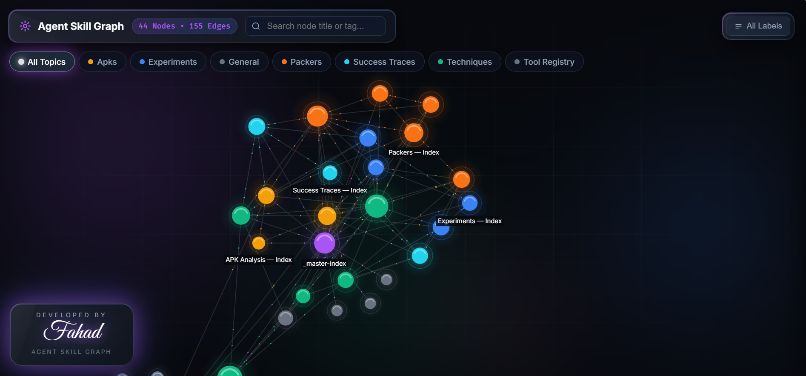

# LLM-RE-KnowledgeBase-Agent

> A file-based, LLM-driven **Reverse Engineering Knowledge Base custodian**. It ingests blogs, papers, pentest findings, and malware write-ups, compiles them into a rigorously structured, cross-linked markdown wiki with anti-hallucination provenance markers, and renders the whole thing as an interactive knowledge graph.

The agent is not a chatbot wrapper — it is a set of instruction files (`AGENTS.md` + `.kb/`) that turn any capable coding/agent LLM (Claude Code, Cursor, etc.) into a disciplined librarian for security-research knowledge. All state lives in plain markdown on disk, so the KB is portable, diff-able, and readable by other agents via direct file traversal.

---

## Pointing an agent at this folder

Hand an agent nothing but this folder's path and its **first and only reply** is one line:

```
Send the APK path to unpack.
```

It will not run `adb`, fingerprint anything, list directories, or ask a second
question. This is an enforced intake gate — `## ⛔ STEP 0 — INTAKE GATE` at the
very top of `AGENTS.md` — evaluated ahead of the KB Custodian role.

**Folder path exception:** If the agent is given a folder path (e.g.
`C:\Users\me\Desktop\apps`), it searches that folder for `.apk` files. If exactly
one APK is found, it proceeds with it. If multiple are found, it lists them and
asks the user to pick one. If none are found, it outputs the one-line message
above and stops.

The gate opens the moment a real APK path arrives (`C:\...\app.apk`,
`~/Downloads/app.apk`, `./app.apk`). The agent then runs the Research Loop:
fingerprint → plan → experiment → gate → record → reindex, using the packer
method already in the vault.

The unpacked result is written **next to the packed APK it came from** — same
folder, named `<input-stem>-unpacked.apk`, with recovered dex in a sibling
`<input-stem>-unpacked-dex/`. The packed original is never modified.

Because it lives in `AGENTS.md`, the behavior holds for any agent host that
reads project instruction files.

---

## Why this exists

RE and security notes rot fast: opcodes get paraphrased away, tool versions go unpinned, blog claims get promoted to "fact," and a year later you can't tell what you *verified* from what an LLM *guessed*. This agent enforces the opposite discipline:

- **Zero-loss compilation** — offsets, hex, registers, JNI signatures, and bypass scripts are preserved verbatim, never summarized.
- **Provenance on every claim** — inline markers separate verified facts (`[V]`) from inference (`[I]`), unverified secondary sources (`[U]`), version-specific behavior (`[VS]`), contradictions (`[X]`), and pure model reasoning (`[AI Synthesis]`).
- **Navigable by machines** — every article carries YAML frontmatter and lives in a hub-and-chunk graph so *other* LLMs can traverse it without confabulating.

---

## Knowledge Graph

<p align="center">
  
</p>

The interactive knowledge graph visualizer renders every wiki article as a node colored by topic, with edges showing cross-references. Open `knowledge_base/visualizer/index.html` in a browser to explore the KB interactively.

The system is three tiers: **user commands** (`ingest` / `compile` / `search`) drive an **AI agent orchestrator** (behavioral rules + a mode dispatcher), which reads from and writes to the **markdown knowledge vault** — turning raw inbox feeds into a compiled, cross-linked graph of articles.

The LLM reads `AGENTS.md` first, matches the user's request to a **mode**, and loads only the instruction files that mode needs.

---

## Core workflow

```
ingest <url>   →   compile <file>   →   search <query>
   crawl            structure             answer
   ─────            ─────────             ──────
 raw/feeds/*     wiki/**/*.md +        unified technical
 raw/assets/*    updated indexes +     response with inline
                 regenerated graph     provenance markers
```

### 1. Ingest — crawl a URL into the inbox
`crawl.py` fetches a page with a realistic User-Agent, extracts the main article via `readability`, recovers `<figure>`/SVG diagrams that readability strips, downloads every image locally (converting `.webp` → `.png`), and writes clean markdown to `knowledge_base/raw/feeds/<slug>.md`.

### 2. Compile — turn raw notes into a structured wiki
The agent classifies the content type (pentest finding, malware analysis, research paper, API doc, analysis notes, or blog), loads the matching schema, and splits deep dives into a **hub + semantic chunks** (one chunk per *technical mechanism*, never per product name). It writes YAML frontmatter, cross-links every article, updates topic and cross-topic indexes, verifies all `[[wiki links]]` resolve, and logs the operation.

### 3. Search — query the KB
The agent routes through `_master-index.md` → topic `_index.md` → article, then composes **one seamless, highly granular technical document** — exact function names, opcodes, structs, and code — with every sentence tagged by provenance. If something isn't in the KB, it says so explicitly rather than blending in training-data priors.

### 4. Visualize — interactive knowledge graph
`graph_generator.py` parses every wiki file, extracts `[[wiki/...]]` links, builds a node/edge graph colored by topic, and writes `knowledge_base/graph/graph_data.js`. Open `knowledge_base/graph/index.html` for a force-directed, searchable, clickable map of the KB.

---

## Command reference

Drive the agent with natural language or these shorthand commands (see `AGENTS.md`):

| Command | Action |
|---|---|
| `ingest <url>` | Crawl a URL → raw markdown + local images inbox |
| `compile <file>` | Process an unprocessed `raw/` file into structured wiki articles |
| `search <query>` | Query the KB → unified answer (KB facts + AI synthesis, inline) |
| `graph` | Build & open the interactive knowledge-graph visualizer |
| `health-check` | Scan for dead links, orphans, missing YAML, stale stubs |
| `gap report` | Report dead links, stale stubs, and underdeveloped topics |
| `contradictions` | List all articles carrying `[X]` conflict markers |
| `modify <apk>` | Analyze, unpack, patch, rebuild, sign, and validate a modified APK |

## APK Modification

The agent supports full APK reverse-engineering and modification:

1. **Inspect** — fingerprint, manifest, DEX, native libs, assets, protections
2. **Unpack** — multi-stage unpacking with recursive layer recovery
3. **Analyze** — static + dynamic analysis, obfuscation identification
4. **Patch** — DEX (smali) and native (ELF) patching
5. **Rebuild** — apktool rebuild with consistency checks
6. **Sign** — sign with test keystore and verify
7. **Validate** — install, launch, and runtime behavior verification

### Modification Categories

- Change application behavior
- Modify UI / resources
- Patch method logic (DEX / smali)
- Patch native code (ARM32/ARM64/x86/x86_64)
- Modify authentication / licensing (test builds only)
- Disable integrity / anti-tamper mechanisms
- Instrument methods with logging
- Replace encrypted assets
- Other custom modifications

See `.agent/modification-protocol.md` for the full protocol.

---

## Provenance marker system

Every factual claim in a wiki article carries a marker so downstream LLMs never confuse sources:

| Marker | Meaning |
|---|---|
| `[V]` | **Verified** — directly confirmed from the cited primary source |
| `[I]` | **Inferred** — logical conclusion from verified facts |
| `[U]` | **Unverified** — from a blog/forum/secondary source |
| `[VS: Frida 16.x]` | **Version-specific** — only applies to the stated version/environment |
| `[X: see <article>]` | **Contradicted** — conflicts with another article |
| `[AI Synthesis]` | **Model intelligence** — general pre-trained reasoning or code patterns |

Every article must also declare `## What This Article Does NOT Cover` and `## Open Questions / Unverified Claims` to keep scope boundaries explicit.

---

## Getting started

### Prerequisites
- Python 3.10+ (the scripts use `X | None` type-union syntax)
- An agent/LLM host that reads project instruction files (e.g. Claude Code)

### 1. Clone
```bash
git clone https://github.com/fatalSec/LLM-RE-KnowledgeBase-Agent.git
cd LLM-RE-KnowledgeBase-Agent
```

### 2. Set up the Python environment (for crawling & graphing)
```bash
python3 -m venv .kb/scripts/.venv
.kb/scripts/.venv/bin/pip install -r .kb/scripts/requirements.txt
```

### 3. Crawl a page into the inbox
```bash
.kb/scripts/.venv/bin/python .kb/scripts/crawl.py "https://example.com/some-re-writeup"
```

### 4. Point your agent at the repo
Open the project in your agent host and ask it to, for example, `compile <slug>.md`, `search "DexProtector anti-frida"`, or run a `health-check`. The agent reads `AGENTS.md` and takes it from there.

### 5. Explore the graph
```bash
.kb/scripts/.venv/bin/python .kb/scripts/graph_generator.py --open
```

---

## Scripts

| Script | Purpose | Key dependencies |
|---|---|---|
| `.kb/scripts/crawl.py` | Fetch a URL, extract the main article, download images locally, emit raw markdown. Handles data-URI images, SVG/figure recovery, and `.webp`→`.png` conversion. | `requests`, `beautifulsoup4`, `lxml`, `readability-lxml`, `markdownify`, `Pillow` |
| `.kb/scripts/graph_generator.py` | Parse the wiki, extract Obsidian links, build the node/edge graph, write `graph_data.js`, optionally open the visualizer. | `PyYAML` (optional; falls back to regex frontmatter parsing) |

> **Note:** `crawl.py` prefers the native macOS `sips` tool for `.webp` conversion and only falls back to `Pillow` when `sips` is unavailable. On non-macOS systems, `Pillow` handles the conversion.

The knowledge-graph visualizer (`knowledge_base/graph/index.html`) loads `force-graph` and `marked` from CDNs and expects internet access when opened in a browser.

---

## Design principles

- **Files, not a database.** The entire KB is markdown + YAML on disk — portable, versionable, and readable by any agent or human.
- **Mechanisms are the unit of knowledge.** Articles are split by technical mechanism, not by product or target name.
- **No orphans.** Every article is indexed in its topic and linked from at least one other article.
- **Version-pin everything.** Tool and SDK versions are always explicit (`Frida 16.x` vs `15.x`, `Android 13` vs `14`).
- **Verify, then trust.** A mandatory verification loop re-checks outputs against source so no opcode or detail is silently dropped.

---
