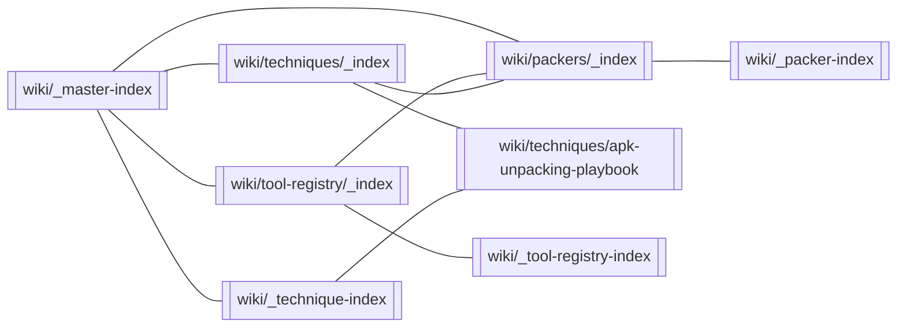

# _master-index

> Mandatory root of every KB. Quick Navigation is rendered as a Mermaid graph by
> `.kb/scripts/graph_generator.py`.

## Quick Navigation

## Topic Index

| Topic | Index article | Status |
|---|---|---|
| packers | [[wiki/packers/_index]] | populated (3 articles: 360-jiagu, xuandun, virex) |
| techniques | [[wiki/techniques/_index]] | populated (2 articles: playbook + T-0020) |
| tool-registry | [[wiki/tool-registry/_index]] | populated (15 host tools TR-0001..TR-0015; on-device tools are runtime-only) |
| apks | [[wiki/apks/_index]] | populated (1 analysis: A-000001) |
| experiments | [[wiki/experiments/_index]] | populated (1 experiment: EXP-0001) |
| success-traces | [[wiki/success-traces/_index]] | populated (1 trace: ST-0001) |
| patterns | — | declared, not yet created |
| knowledge-diffs | — | declared, not yet created |
| binary-format | — | declared, not yet created |
| dynamic-analysis | — | declared, not yet created |
| native-analysis | — | declared, not yet created |
| static-analysis | — | declared, not yet created |
| vm-packing | — | declared, not yet created |

> Device/environment profiles are **not** a topic: environment state is
> runtime-only (`env_probe.py --health`) and never stored (Iron Rule 6).

## Recent additions

| Date | Article | What |
|---|---|---|
| 2026-09-29 | [[wiki/packers/virex]] | Packer article: ViRex (offline BXDV/DVMP decrypt + cert anti-tamper patch), unpacked |
| 2026-09-29 | [[wiki/packers/xuandun]] | Packer article: XuanDun v3.3 (memory-scarf T-0010 path), unpacked |
| 2026-09-29 | [[wiki/packers/360-jiagu]] | Packer article: 360 jiagu / PokeGuard (char-table + container walk + on-device harvest), unpacked |
| 2026-09-29 | [[wiki/techniques/T-0020]] | First structured technique extracted: packed-APK baseline verification gate (CANDIDATE, 0.7, evidence EXP-0001) |
| 2026-09-29 | [[wiki/success-traces/ST-0001]] | First success trace: verified baseline of packed pokemon.dex.guard from EXP-0001; causality INFERENCE, essential factors container integrity + DEX header |
| 2026-09-29 | [[wiki/experiments/EXP-0001]] | First experiment: T-0008 baseline on packed pokemon.dex.guard - shell dex validated (639 strings), qihoo loader classes confirmed, gate VERIFIED_SUCCESS across 5 categories |
| 2026-09-29 | [[wiki/apks/A-000001-pokemon.dex.guard]] | APK intake: pokemon.dex.guard 1.5, sha 2481b4e4…, protections [360 jiagu, Tencent/libSecShell, VMP markers, custom containers] |
| 2026-09-29 | [[wiki/tool-registry/_index]] | Tool registry: 15 host tools (TR-0001..TR-0015) with versions, capabilities, install notes |
| 2026-09-29 | [[wiki/techniques/apk-unpacking-playbook]] | Full unpacking playbook: all 15 techniques from the XuanDun v3.3 and ViRex sessions |

## Related

- [[wiki/_packer-index]] — cross-topic packer index
- [[wiki/_technique-index]] — cross-topic technique index
- [[wiki/_tool-registry-index]] — cross-topic tool index
- [[wiki/_apk-index]] — cross-topic APK analysis index
